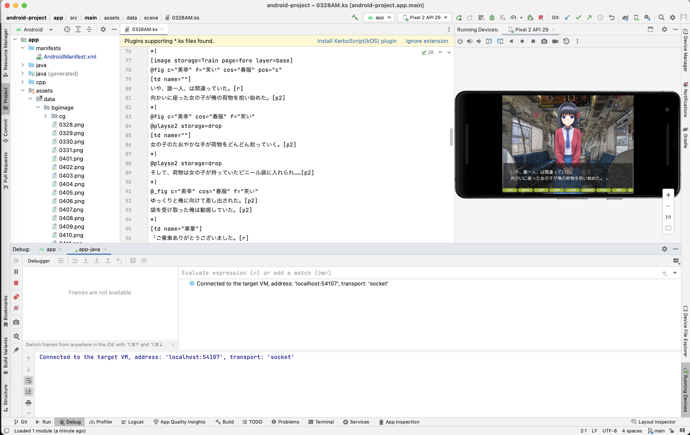
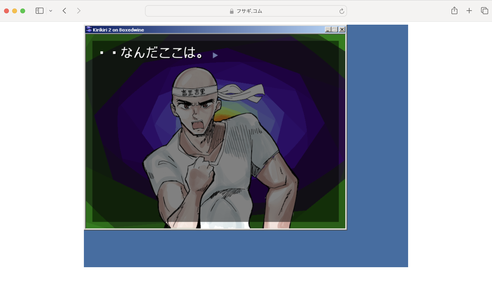

# 吉里吉里SDL2を動かす

## 対象読者

現在吉里吉里2/Z製のゲームを持っている人で、Windows以外に移植したいと思っている人を対象にしています。
既存の吉里吉里についての仕様はある程度「わかっていること」を前提にしています。

開発中のエンジンであるため、あまり楽に使えるものではありません。吉里吉里SDL2を使う場合は、自らも開発に参加するという覚悟が必要です。その関係でC/C++用語含む難しい用語よく出てきます。ご了承ください。

この本はあえて「紙」で出します。この本を見ながら手元の吉里吉里2製のゲームを他のプラットフォームに移植していただけたら幸いです。

この本は2023年12月現在における仕様のメモのような情報です。実際に吉里吉里2/Z製アプリを移植する際は、情報が古くなっていないか確認してください。

この本のWeb版および訂正情報・最新情報は以下に掲載しています。

吉里吉里SDL2の謎本<br>
<https://puri.work/books>

## 吉里吉里SDL2とは

比較のため過去のバージョンの仕様も簡単に書いてきます。

### 吉里吉里とは

吉里吉里はTJSという言語の実行環境です。<br>
吉里吉里/TJSを使うと2Dゲームやアプリケーションを作ることができます。

「吉里吉里SDL2」がサポートするのは「TJS2」（TJSの2番目のバージョン）です。<br>吉里吉里2、吉里吉里Z、吉里吉里SDL2はすべてTJS2の実行環境です。

### 吉里吉里2および吉里吉里Zとの関連性について

読者の方々は「吉里吉里2」「吉里吉里Z」をご存知だと思います。<br>
「吉里吉里Z」は「吉里吉里2」の後継版であり、「吉里吉里SDL2」は「吉里吉里Z」のSDL環境移植です。

SDL (Simple DirectMedia Layer) とは、C言語で書かれたクロスプラットフォームのマルチメディアライブラリです。マルチメディアを扱う際の環境の違いを吸収します。

吉里吉里2や吉里吉里Zが基本的にWindowsでの動作のみサポートされているのに対して、
吉里吉里SDL2はSDL2(SDLの2番目のバージョン)がサポートする様々な環境で動作します。

理論上、以下のどのプラットフォームでも同じレベルでの高速動作が可能です。

- Web
- iOS
- Android
- Windows
- MacOS
- Linux

もしあなたが移植を手伝ってくださるならば、吉里吉里SDL2はきっとどんな環境でも動くでしょう。

### KAGとは

KAG(Kirikiri Adventure Game)は、吉里吉里を用いてADV/ノベルゲームを開発するためのスクリプトです。
KAGは、シナリオファイルという、文章中に「タグ」(指令) を書き込んだテキストファイルを解釈します。

「吉里吉里SDL2」がサポートするのは「KAG3」（KAGの3番目のバージョン）です。吉里吉里2、吉里吉里Z、吉里吉里SDL2はすべてKAG3を解釈することができます。

ただし、吉里吉里のそれぞれのバージョンでKAG3の対応のされ方が違います。

- 吉里吉里2では吉里吉里エンジン本体がKAG3を解釈していました。
- 吉里吉里Z移行では本体の機能としては分離・除外され、KAG3解釈用のプラグイン(KAGParser.dll)を読み込む形となりました。
- 吉里吉里SDL2の開発者uyjulianさんにより、KAG3は純粋なTJS2で再実装されました。
  - 吉里吉里SDL2単体ではKAG3を解釈する機能はもたず、こちらのTJS2による再実装によりKAG3を解釈します。
  - 吉里吉里SDL2のみならず、吉里吉里Zでも読み込んで使うことができます。
    - これにより、吉里吉里ZでKAG3を解釈する際にKAG3解釈用のプラグインを読む必要がなくなります。

## 吉里吉里SDL2で「できないこと」

吉里吉里Zからの移行では注意しないといけないことがあります。

### 正式リリースされておらず、いまだα版に近い

2023年12月現在、まだまだ多くの不具合があり、真面目に使うならそれなりの覚悟が必要です。

とはいえ、吉里吉里SDL2は「生きている」プロジェクトです。不具合については現在進行系で直されています。

### Windows環境で動作する吉里吉里プラグインはそのままでは動作しない

吉里吉里プラグインとは、TJSからC/C++コードを操作するための仕組みです。既存のTJSクラスに自作関数やプロパティを追加したり、新規の自作クラスを追加したりできます。

吉里吉里2/Zにおける吉里吉里プラグインで使われるDLLという仕組みは、Windowsで動的に組み込めるプログラムの部品です。

DLLはWindowsの仕組みなので、仕組みとしてのDLLはWindows以外のコンピューターシステムでは使えません。実際、吉里吉里SDL2ではWindows以外の環境で以下のコードをうまく扱えません。

``` tjs
Plugins.link("hoge.dll");
```
「動的に組み込める」という部分も問題が多く、現在2023年12月現在では静的にリンクする方法が一番安定しています。これは、吉里吉里SDL2本体に吉里吉里プラグインを合体させ、組み込んでしまう方法です。

吉里吉里プラグインを簡単に作れる仕組みであるncbindは引き続き吉里吉里SDL2で動作するので、ソースコードをSDL2移植する根気さえあれば動かせます。

公式で提供されているプラグインは順次吉里吉里SDL2に移植されていく可能性があります。もしくは読者のみなさんが吉里吉里プラグインのSDL2移植をして公開していただければ、それは皆が使えるものになります。

2023年現在における吉里吉里SDL2プラグインの組み込み方法は「吉里吉里SDL2プラグインの作り方」で後述します。

また、Web版においてはある程度JavaScriptで代替が出来ます。「Web版吉里吉里SDL2のJavaScriptブリッジ」で後述します。

## 吉里吉里Zから吉里吉里SDL2への移行

この文章をお読みになる方は、吉里吉里2/吉里吉里Zからの移行を考えている方がほとんどだと思います。すべての吉里吉里製ゲームをカバーできるものではありませんが、吉里吉里Zからの移植のコツをここに簡単に書いていきます。

吉里吉里2の方は、先にTJS/KAGファイルの文字コードをUTF-16LEにしてください。
以下のサイトが便利です。

「吉里吉里2から吉里吉里Z/SDL2への移行支援」ツール<br>
<https://puri.work/krkr/rewrite/>

吉里吉里Zと比べると「吉里吉里SDL2」には主に以下が実装されていません。

<dl>
  <dt>menu.dll吉里吉里プラグインが実装されていない</dt>
  <dd>つまり、メニューは現状使えません。スタブ（代替コード）にします。</dd>
   <dt>wuvorbis.dllプラグインが実装されていない</dt>
   <dd>つまり、Ogg Vorbisは現状使えません。音声ファイルをOpusに変換し、吉里吉里Zではkropus.dllを使ってください。</dd>
  <dt>標準フォント</dt>
  <dd>吉里吉里Zなら必ずWindowsなのでMSゴシックとかがつかえるんでしょうが<br>
クロスプラットフォームなのでデフォルトフォントは用意してやる必要があります</dd>
	<dt>KAGParser.dllが必要なくなった</dt>
	<dd>TJS2で再実装されました。以下作業をすれば、吉里吉里Zでも必要なくなります。</dd>
</dl>

では、どうすれば良いかというと、ざっくり以下の手順を行えば良いです。

> 音声ファイルをOpusに変換

↓

>「KAG3 for 吉里吉里SDL2」をダウンロード<br>
<https://github.com/krkrsdl2/kag3>

↓

> 「data/system_polyfill」フォルダを自分のプロジェクトにコピー

↓

>startup.tjsに以下の記述を入れます。

```tjs
// 機能が欠落している吉里吉里のバージョンのポリフィル関数を初期化します。
Scripts.execStorage("system_polyfill/PolyfillInitialize.tjs");
```

↓

> data.xp3を作成し、吉里吉里Z/SDL2で動作することを確認。


以下、細かい話になります。

### セーブでコケる(MacOS/iOS)

「Cannot open storage よくわからない文字列/datasc.ksd」というエラーが出る場合

MainWIndow.tjsに以下の記述がある場合は

```js
// saveDataLocation がフルパスでないようならば System.exePath を
// 付け加える
if(saveDataLocation.indexOf(":") == -1)
       saveDataLocation = System.exePath + saveDataLocation;
```
<https://github.com/krkrz/kag3/blob/master/data/system/MainWindow.tjs#L288>

このように書き換えてください

```js
// saveDataLocation がフルパスでないようならば System.dataPath にする
if(saveDataLocation.indexOf(":") == -1)
     saveDataLocation = System.dataPath;
```

iOSなど一部の環境は「System.exePath」とはアプリ本体（が入っているフォルダ）のことを指します。

Appleのセキリティポリシーなどの理由により、アプリ本体を書き換えることは許可されていません。

System.dataPathは「書き換えても良い場所」を指すので吉里吉里Zでもこちらのほうがベターだと思います。

### モーダルWindowが死ぬ(Web/Android/iOS)

「Windowの概念がない環境下ではモーダルWindowが動かない」ことに由来しSDLのエラーが出現します。

具体的に困るのは「WebやAndroidやiOSでYesNoDialog.tjsが動かない」という症状です。

一応、Web版だけなら後述するJavaScriptブリッジによりJavaScriptに逃がすという方法があります。

data/system/YesNoDialog.tjsを以下のように書き換えてください。

```tjs
// Yes か No かはっきりさせる関数
function askYesNo(message, caption = "確認")
{
    // Webはこちらに分岐 JavaScriptのconfirm関数を使う
    if(typeof(global.KirikiriEmscriptenInterface) == "Object"){
	var js = KirikiriEmscriptenInterface.evalJS('window');
	return js.confirm(message);
    }
    // 他の吉里吉里SDL2環境や吉里吉里Zはこちらに分岐
    else{
        var win = new YesNoDialogWindow(message, caption);
        win.showModal();
        var res = win.result;
        invalidate win;
        return res;
    }
}
```

iOSやAndroidについては、後述の吉里吉里プラグインの例が使えます。

※これについては近々修正されるそうです。

## Web版吉里吉里SDL2のJavaScriptブリッジ

Web版吉里吉里SDL2はJavascriptを呼び出せます。
足りない機能をJavaScriptで書けたりします。

仕組みとしてはEmscriptenの仕組みを呼び出す吉里吉里プラグインであり、実装は「krkrsdl2/src/plugins/kremscripten.cpp」にあります。

### JavascriptからTJSを呼ぶ

Module.evalTJSからTJSを呼ぶことができます。

```javascript :test.js
const result = Module.evalTJS('TJS式');

// 例
const platformName = Module.evalTJS('System.platformName');
```

なお、以下スニペットを組み込むと、Google Chrome上でTJSオブジェクトのサジェストが使えます。
<https://gist.github.com/xyx0no646/96104a193b0744189fb3102f4e8c0be0>

```js :test.js
const tjsGrobal = Module.evalTJSObject("global");

tjsGrobal.K // KAGがサジェストされる
```

### TJSからJavaScriptを呼ぶ

KirikiriEmscriptenInterface.evalJSからJavaScriptを呼ぶことができます。

```tjs :test.tjs
var tjs = KirikiriEmscriptenInterface.evalJS('JavaScript式');

// 例
var window = KirikiriEmscriptenInterface.evalJS('window');
window.alert('hello world'); //JavaScriptがいかにもTJSのコードのように動作する
```


### XP3ファイル内部のJavaScriptを読む

XP3ファイル内部にJavaScriptがある場合、それを読み込めます。

```tjs :test.tjs
// test.jsを読む
KirikiriEmscriptenInterface.evalStorageJS('file://./data.xp3>test.js', '');
```

### JavaScript上でXP3ファイルを扱う

xp3内部のファイルをJavaScriptコンテキスト上のUInt8Arrayにすることができます。<br>
Blobのような扱いやすい形にも変換できます。

```javascript :test.js
// test.oggをJavaScript世界のBlobとして持ってくる
const blob = new Blob([Module.getStorageUInt8Array("test.ogg")], {type: "audio/ogg"}));
```

### 参考リンク

TJS<->JS interface information<br>
<https://gist.github.com/uyjulian/66bb0466136d04bc1920d55894edb8c0>

## 吉里吉里SDL2のビルド方法

### Web/Windowsへのビルド方法

Dockerにてビルド出来ます。

※プラグインが必要ない場合はビルドする必要はありません。

公式サイト：<https://krkrsdl2.github.io/krkrsdl2/>

からビルド済みのものをダウンロードしてください。

特にWeb版の場合は、吉里吉里リリーサーでindex.htmlのあるフォルダにdata.xp3を作成・配置してサーバーに配置すると動作します。

#### GitとDockerのインストール
```bash
# dockerのインストール　すでにDocker Desktopが入っている人は必要ない
curl -fsSL https://get.docker.com -o get-docker.sh
sudo sh get-docker.sh
# docker composeのインストール　すでにDocker Desktopが入っている人は必要ない
sudo curl -L "https://github.com/docker/compose/releases/download/1.29.2/docker-compose-$(uname -s)-$(uname -m)" -o /usr/local/bin/docker-compose
sudo chmod +x /usr/local/bin/docker-compose
# gitをインストール　すでにgitが入っている人は必要ない
sudo apt-get install git
```
以上はUbuntuでのビルド例です。

Windowsの方はWSL2を有効にしてください。<br>
MacOSの方は公式サイトからGitとDockerをインストールしてください。
#### Dockerでビルドする

```bash
# ビルド用のファイルをcloneする
git clone https://github.com/xyx0no646/krkrsdl2_docker_build.git
cd krkrsdl2_docker_build
# 吉里吉里SDL2をクローンする
git clone --recursive https://github.com/krkrsdl2/krkrsdl2.git
# ここでkrkrsdl2フォルダをいじる(プラグインを入れる場合)

# ビルドする MacOSではsudoはいらないかもしれない
sudo docker-compose up
```

上記を行うと、buildフォルダが出来上がっております。

Webの場合はbuildWebフォルダにある

- index.html
- krkrsdl2.js
- krkrsdl2.wasm

を取り出し、吉里吉里リリーサーでdata.xp3を作成・配置してサーバーに配置してください。


### Androidへのビルド方法

Gitをインストールし、吉里吉里SDL2をクローンします。

```bash
# 吉里吉里SDL2をクローンする
git clone --recursive https://github.com/krkrsdl2/krkrsdl2.git
```

必要に応じて吉里吉里プラグインを追加してから、android-projectフォルダをAndroidStudioで開くと動作します。

app/assetsフォルダにdata.xp3もしくはdataフォルダを配置して「▶」ボタンを押下するとそのまま動作します。

Androidアプリの作り方の一般的な作法などについては省略します。



### iOSへのビルド方法

MacOSが必要です。また、Apple Developperである必要があります。

#### Xcodeのインストール

iOS/MacOS開発をするために必須のツールです。もうインストールしている人は飛ばしてください。

Xcodeは以下のリンクからダウンロードできます。

[https://developer.apple.com/jp/xcode/](https://developer.apple.com/jp/xcode/)

#### homebrewのインストール

PythonやSDL2をインストールするために必要です。もうインストールしている人は飛ばしてください。

Homebrewは以下からインストールできます。

[https://brew.sh/index_ja](https://brew.sh/index_ja)

```bash
#git
brew install git
#cmake
brew install cmake
#SDL2
brew install sdl2 sdl2_image sdl2_ttf sdl2_mixer sdl2_gfx sdl2_net
#python3(pip3の導入のため)
brew install python3
```bash

Gitをインストールし、吉里吉里SDL2をクローンします。

```bash
# 吉里吉里SDL2をクローンする
git clone --recursive https://github.com/krkrsdl2/krkrsdl2.git
```

cmakeでプロジェクトを作ります。

```bash
cd krkrsdl2
cmake . -G Xcode -DCMAKE_SYSTEM_NAME=iOS -B ./iOSBuild
```

「krkrsdl2.xcodeproj」をXCodeで開き、コード署名をしてから「▶」ボタンを押下するとそのまま動作します。

iOSアプリの作り方の一般的な作法などについては省略します。

## 吉里吉里SDL2プラグインの作り方

このセクションはC/C++ができる方向けの情報です。

今回はncbindを使います。

参考：ncbind のススメ (吉里吉里)<br>
[https://ruriko.denpa.org/200705c.html](https://ruriko.denpa.org/200705c.html)

コードの書き方は吉里吉里2/Zプラグインと同一です。ただし、Win32 APIの代わりにSDL2のSDL関数を使ってください。

### 一番簡単な例

以下の吉里吉里プラグインはSDLを使用し、コンソールに文字を表示します。

```cpp :displaytext.cc
#include "ncbind/ncbind.hpp"
#include "CharacterSet.h"
#include <SDL.h>

class DisplayText{
public:
	// この関数が呼ばれる
    tjs_int show(TJS::tTJSVariant tValue){
	    // TJSの文字列からC++のstd::stringへ変換
        std::string message;
        TVPUtf16ToUtf8( message, tTJSString(tValue).AsStdString()); 
        // SDLでのログの表示
        SDL_Log("%s", message.c_str());
        // 吉里吉里へ値を戻す。ここでは1111が戻る。
        return 1111;
    }
};
NCB_REGISTER_CLASS(Debugger) {
  NCB_CONSTRUCTOR(()); // コンストラクタ
  NCB_METHOD(show); // show関数の定義
};
```

これはTJS上で以下のように使うことが可能です。

```tjs :test.tjs
ver text = new DisplayText();
var result = text.show("こんにちは世界"); // 1111が戻る
```

### YesNoDialogライクなプラグインの例

```cpp : krkruialert.cc
#include "ncbind/ncbind.hpp"
#include "CharacterSet.h"
#include <SDL.h>

/**
 * 同期モードで動くYesNoDialogプラグイン
 * Licenced by CC0
 *
 * usage:
 * KrkrUIAlert.askYesNo("テスト","これはテストですね");
 */

class KrkrUIAlert {
public:
    static tjs_int askYesNo(TJS::tTJSString tTitle,TJS::tTJSString tMessage)
    {
        const SDL_MessageBoxButtonData buttons[] = {
             { /* .flags, .buttonid, .text */        0, 0, "いいえ" },
             { SDL_MESSAGEBOX_BUTTON_RETURNKEY_DEFAULT, 1, "はい" },
         };
         const SDL_MessageBoxColorScheme colorScheme = {
             { /* .colors (.r, .g, .b) */
                 /* [SDL_MESSAGEBOX_COLOR_BACKGROUND] */
                 { 255,   0,   0 },
                 /* [SDL_MESSAGEBOX_COLOR_TEXT] */
                 {   0, 255,   0 },
                 /* [SDL_MESSAGEBOX_COLOR_BUTTON_BORDER] */
                 { 255, 255,   0 },
                 /* [SDL_MESSAGEBOX_COLOR_BUTTON_BACKGROUND] */
                 {   0,   0, 255 },
                 /* [SDL_MESSAGEBOX_COLOR_BUTTON_SELECTED] */
                 { 255,   0, 255 }
             }
         };
    
		// TJS文字列をstd::stringに変換
        std::string title;
        TVPUtf16ToUtf8( title, tTJSString(tTitle).AsStdString() );
        std::string message;
        TVPUtf16ToUtf8( message, tTJSString(tMessage).AsStdString());

        const SDL_MessageBoxData messageboxdata = {
             SDL_MESSAGEBOX_INFORMATION, /* .flags */
             NULL, /* .window */
             title.c_str(), /* .title */
             message.c_str(), /* .message */
             SDL_arraysize(buttons), /* .numbuttons */
             buttons, /* .buttons */
             &colorScheme /* .colorScheme */
         };
         int buttonid;
         if (SDL_ShowMessageBox(&messageboxdata, &buttonid) < 0) {
             SDL_Log("メッセージボックスの表示に失敗した");
             return 1;
         }
         if (buttonid == -1) {
             SDL_Log("選択されなかった");
         } else {
            SDL_Log("%sが選択された", buttons[buttonid].text);
         }
        return buttonid;
    }
};

NCB_REGISTER_CLASS(KrkrUIAlert) {
  NCB_CONSTRUCTOR(());
  NCB_METHOD(askYesNo);
};
```

### 吉里吉里プラグインのビルド方法

現行において、吉里吉里プラグインを使うには静的リンクが一番安定しています。

Gitをインストールし、吉里吉里SDL2をクローンします。

```bash
# 吉里吉里SDL2をクローンする
git clone --recursive https://github.com/krkrsdl2/krkrsdl2.git
```

krkrsdl2/src/pluginsにプラグインのC++コードを置きます。

置きおわったら、krkrsdl2/CMakeLists.txtの末尾に以下の記述をします。

```cmake
list(APPEND KRKRSDL2_SRC src/plugins/プラグインのファイル名.cpp)
```

上記の状態でビルドしてください。ビルド方法は前述の項目を参照ください。


## 追記

以下、吉里吉里関連の技術の簡単な紹介となります。これについても今後、同人誌として出したいと思っています。

### 吉里吉里Releaser NGについて

吉里吉里Releaser NGとは、Linux/Mac/Windowsなどのコンソール環境で使える吉里吉里リリーサーの移植版です。

NGは「New Generation」の略で、Windows環境がなくてもXP3ファイルが作れます。なんとWebでも動きます。<br>

Web版 吉里吉里リリーサーNG　技術デモ<br>
<https://puri.work/krkr/krkrrel/>

移植したのは吉里吉里SDL2の作者、Julian Uyさんです。

krkrrel-ng<br>
<https://github.com/krkrsdl2/krkrrel-ng>

### BoxedWine + 吉里吉里2の紹介

未変更の吉里吉里2アプリを他の環境で実行したいというニーズもあるとおもうので、ここで簡単にBoxedWineの紹介をしておきます。

BoxedWineはWineHQ上でWindowsアプリケーションを動作させることができるオープンソースのLinuxエミュレータです。見た目はWindows95そっくりです。



BoxedwineはC++で書かれ、SDLを使用しており、Windows、Mac、Linux、そしてブラウザがサポートされています。Androidのサポートを準備しているような痕跡もあります。
16ビットおよび32ビットのWindowsアプリケーションを未変更で実行できます​。

ただし、現状BoxedWineはShift-JISに対応していません。（結局TJS/KAGをUTF16-LEに変換する操作は必要になります）
また、そもそも日本語にも対応していないため、日本語フォントを入れる作業は必要になりそうです。

また、CPUをエミュレートしているため、特にブラウザでは実機の1万分の1のオーダの性能しか出ません。なので、動作させるにはいくつか工夫が必要です。また、ライセンスがGPL2なので、Web以外での利用の際は特に注意が必要です。

BoxedWineで吉里吉里2を動かすHowToについては、次の機会に本にしたいと思います。


<br><br><br><br><br>


## 謝辞

しぇいむ☆おん 17周年おめでとうございます！

吉里吉里SDL2のサンプル画像として出ていただきました女性キャラは<br>
《しぇいむ☆おん》および制作中の《しぇいむ☆おん》二次創作に出てくる栗原美幸ちゃんです。<br>
描いたのはにじますさん(<https://twitter.com/syakepappa8881>)です。

BoxedWineのサンプル画像として出てきました男性キャラ（吉里吉里マン）はオリジナルです。<br>
描いたのはナモーさん(<https://twitter.com/namorton09>)です。

裏表紙は私（蜜柑ぷり）が描きました、黒い既製品のメイド服を着た《しぇいむ☆おん》の栗原美幸ちゃんです。

吉里吉里2/Zに関わった方々、また、吉里吉里SDL2の作者であるuyjulianさんに心から感謝いたします。

## 奥付

発行：サークル「蜜柑ぷり」

X(Twitter) :<https://twitter.com/xyx0no646> 

サークル公式サイト :<https://puri.work>

| 発行日 | 概要|バージョン|
| ---- | ---- |---- |
| 2023/12/31 |  初版 | 0.0.1|
